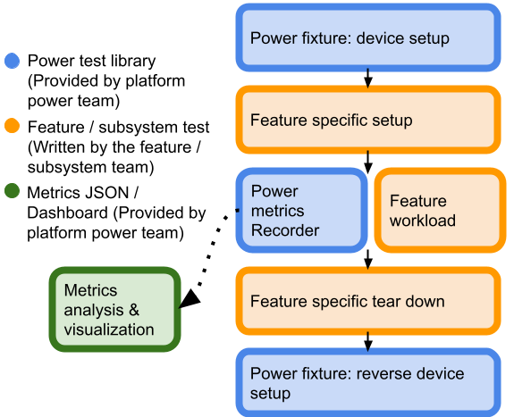

# README: Local Tast Power Tests

> This document assumes that you are familiar with [general Tast documentation].

[general Tast documentation]: https://chromium.googlesource.com/chromiumos/platform/tast/+/HEAD/docs/

[TOC]

## Introduction
Local Tast power test sets up a device for power measurement and collects power
metrics while running a workload.

## Workflow

* Power fixtures provide consistent device setup across devices and across tests
  especially for A/B testing.
* Power metrics `Recorder` collects metrics while running feature workload.
* Feature team only needs to provide feature / subsystem workload.
* See [Codelab #1] for detailed explanation on each step.

[Codelab #1]: docs/codelab_1.md

## Documentation
Look at [docs] directory for topics in detail and codelabs on how to write a
power test.

[docs]: docs/

## Results
To understand the metrics that are collected, see [metrics.md].

[metrics.md]: docs/metrics.md

### Local visualization
A local html data visualization of the collected power metrics is at
`tests/<TEST NAME>/power_log.html`.

### Power dashboard
The previously mentioned `tests/<TEST NAME>/power_log.html` contains a link to
the visualization of the test run in the power dashboard.

Otherwise, access directly at http://go/power-dashboard-view and filter the
criteria to view data visualization.

### Crosbolt dashboard
http://go/crosbolt and filter the criteria to view.

To monitor regression through crosbolt, see http://go/power-test-regression.

## Feedback

If you have any feature requests / bugs / feedback please feel free to share with us:
* [Power Buganizer List] (go/cros-power-buganizer)
* [ChromeOS Power Q&A Chat Room] (go/cros-power-q&a)

[ChromeOS Power Q&A Chat Room]: go/cros-power-q&a
[Power Buganizer List]: go/cros-power-buganizer
