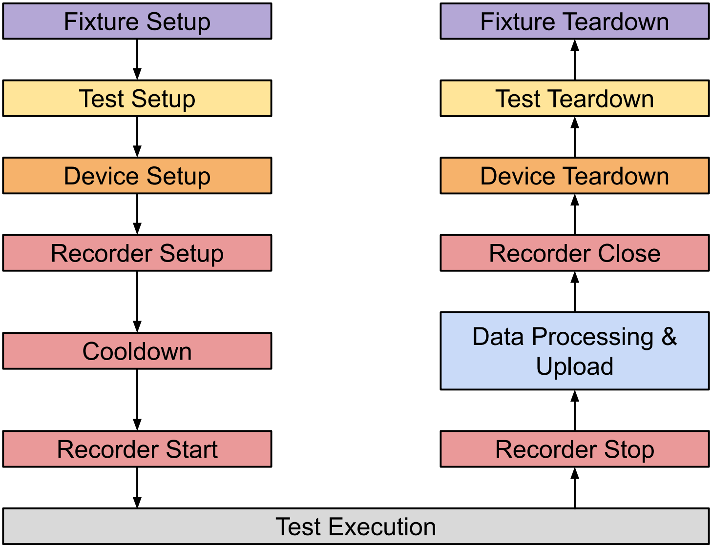

# Tast Remote Power Tests Codelab: Introduction to Remote Power Test Services

This is the location for tast remote power test codelabs. For local power tests,
see [Tast Local Power Tests].

[Tast Local Power Tests]: https://crsrc.org/o/src/platform/tast-tests/src/go.chromium.org/tast-tests/cros/local/power/docs/

This codelab introduces the basics of the remote power test and how to use
remote power test services.

## Prerequisites

The remote power test is designed around Tast’s remote test workflow. If you are
not familiar with remote tests in general, please have a look at [Tast Codelab:
Remote tests] first before proceeding.

[Tast Codelab: Remote tests]: https://chromium.googlesource.com/chromiumos/platform/tast/+/HEAD/docs/codelab_4.md

## Remote Power Test

In this codelab, a remote power test is referring to a remote test that records
power metrics over a feature run to understand how it affects the power
consumption. The measurements are captured by querying system states on the DUT,
as opposed to using specialised hardware, such as a Servo or Cros Power Debugger
(CPD). Since running this type of remote power test does not require specialised
hardware and modification to the DUT, this is a non-intrusive way of measuring
power.

The remote power tests that use specialised hardware and require reworking the
DUT to attach the hardware are classified as intrusive remote power tests. For
more details, see [Servod Wrapper Codelab].

[Servod Wrapper Codelab]:https://crsrc.org/o/src/platform/tast-tests/src/go.chromium.org/tast-tests/cros/remote/power/docs/codelab_servod_wrapper.md

## Available Services

The following gRPC services are available for remote tests:

* [`DeviceSetupService`] is used to set up and tear down the power test
  environment on the DUT.
* [`RecorderService`] records power metrics on the DUT and returns recording
  results to the remote side.

The services are usually used together but can be used independently as you see
fit.

[`DeviceSetupService`]:https://crsrc.org/o/src/platform/tast-tests/src/go.chromium.org/tast-tests/cros/services/cros/power/device_setup_service.proto

[`RecorderService`]:https://crsrc.org/o/src/platform/tast-tests/src/go.chromium.org/tast-tests/cros/services/cros/power/recorder_service.proto

## Situations Where You Need This

Remote test can be used when:

* The test setup phase involves rebooting the DUT or any other operations that
  may interfere with test execution on the DUT.

* Testing is not limited to a single DUT and may involve multiple DUTs or
  external hardware such as Bluetooth and Wi-Fi devices.

## Limitations

You can use this workflow to measure the power as long as your test satisfies
the following conditions.

* You can perform any operations (such as reboot and suspend) before
  `DeviceSetupService` and `RecorderService` are set-up and after they are
  torn-down.

* You cannot perform any operations that may terminate or interfere with the
  `DeviceSetupService` and `RecorderService` after they are set-up and before
  they are torn-down.

For example, you may reboot your DUT during your test set-up or clean-up phase
but you cannot do so while  measuring power.

If your test violates any of the conditions above, you might need an intrusive
remote power test instead.

## Workflow

The remote power test workflow is shown in the diagram below.

* Written by the Test Author
  * Test Setup and Teardown
  * Test Execution
* Provided by Remote Power Test
  * Device Setup and Teardown
  * Recorder Setup, Cooldown, Start, Stop and Close
  * Data Processing and Upload

Generally speaking, you want to perform device and recorder setup after the test
setup as your test may reboot during the test setup phase, which would reset
many DUT environments and terminate the recorder. Additionally, you can insert
additional metrics to the recorded results in the data processing and uploading
phase on the remote side.



## Available remote services

### Device Setup Service

The [`DeviceSetupService`] comes with two endpoints, the `Setup` and `Cleanup`.

```proto
service DeviceSetupService {
    // Setup device for power test.
    rpc Setup(DeviceSetupRequest) returns (google.protobuf.Empty) {}

    // Cleanup resets device to its original state.
    rpc Cleanup(google.protobuf.Empty) returns (google.protobuf.Empty) {}
}
```

The `Setup` call sets up the power test environment on the DUT and the
environment can be configured using the `DeviceSetupRequest`. Currently, the
configurable environment includes user interface, screen brightness, keyboard
brightness, wifi and bluetooth. Specific settings are shown below. This is only
a subset of the [options] available to the local power test but can be easily
extended in the future if there is a need for more options.

[options]:https://crsrc.org/o/src/platform/tast-tests/src/go.chromium.org/tast-tests/cros/local/power/setup/setup.go

```proto
message DeviceSetupRequest {
    optional string setup_name = 1;
    UIMode ui = 2;
    ScreenMode screen_brightness = 3;
    KeyboardMode keyboard_brightness= 4;
    WifiMode wifi = 5;
    BluetoothMode bluetooth = 6;
}

enum UIMode {
    DO_NOT_CHANGE_UI = 0;
    DISABLE_UI = 1;
}

enum ScreenMode {
    DEFAULT_SCREEN_BRIGHTNESS = 0;
    DO_NOT_CHANGE_SCREEN_BRIGHTNESS = 1;
    ZERO_SCREEN_BRIGHTNESS = 2;
}

enum KeyboardMode {
    DEFAULT_KEYBOARD_BRIGHTNESS = 0;
    DO_NOT_CHANGE_KEYBOARD_BRIGHTNESS = 1;
    ZERO_KEYBOARD_BRIGHTNESS = 2;
}

enum WifiMode {
    DO_NOT_CHANGE_WIFI = 0;
    DISABLE_WIFI = 1;
}

enum BluetoothMode {
    DISABLE_BLUETOOTH = 0;
    DO_NOT_CHANGE_BLUETOOTH = 1;
}
```

The `Cleanup` call is used to roll back all the changes made to the DUT
environment during the `Setup` call. This must be called after the test;
otherwise, later tests runs may be affected. e.g. the DUT may continue
to drain the battery indefinitely.

### Recorder Service

The [`RecorderService`] has 4 endpoints, the `Create`, `Start`, `Stop` and `Close`.

```proto
service RecorderService {
    rpc Create(RecorderRequest) returns (google.protobuf.Empty) {}
    rpc Start(google.protobuf.Empty) returns (google.protobuf.Empty) {}
    rpc Stop(google.protobuf.Empty) returns (RecorderResult) {}
    rpc Close(google.protobuf.Empty) returns (google.protobuf.Empty) {}
}
```

The recorder can be created using the `Create` call and the sampling interval in
seconds must be specified through the `RecorderRequest`. It is recommended that
sampling intervals be at least 5 seconds. This is because the time needed to
sample once can be quite long sometimes.

```proto
message RecorderRequest {
    int64 interval_sec = 1;
}
```

Once the recorder is created, we can start recording power metrics using the
`Start` call. After the test is finished, the recording can be stopped by using
the `Stop` call. The `Stop` call returns a `RecorderResult`, which includes the
recorded power metrics in the form of `perf.Values` and other DUT related
information needed for data processing. This is the point where you can examine,
process, save and/or upload the results. For more details, see the next section.

```proto
message RecorderResult {
    tast.common.perf.perfpb.Values perf_metrics = 1;
    tast.common.power.powerpb.OneTimeMetrics one_time_metrics = 2;
    tast.common.power.powerpb.DeviceInfo device_info = 3;
}
```

After the recorder has stopped recording, you may `Close` the recorder or start
a new recording again with the `Start` function. Note that it is not possible to
continue previously stopped recording.

## Data Processing, Saving and Uploading

It is recommended that you should process the recording results in the following
order:

* Saving and uploading result to the Power Dashboard.
* Add additional metrics for uploading to Crosbolt Dashboard.
* Saving result to the Crosbolt Dashboard.

You may skip any of the steps but the order should be followed.

That being said, it is possible to do them in different order but you should be
aware of the assumptions at each step, which would be described below.

### Saving and Uploading Result to the Power Dashboard

The function [`CreateSaveUploadPowerLog`] can be used to save power metrics (in
the form of `power_log.json`) to the specified directory and upload it to the power
dashboard.

[`CreateSaveUploadPowerLog`]:https://crsrc.org/o/src/platform/tast-tests/src/go.chromium.org/tast-tests/cros/common/power/power_dashboard.go;?q=CreateSaveUploadPowerLog

You should provide the unmodified recorded metrics and DUT info for this
function as it expects a strict and pre-defined set of metrics. Including
unspecified metrics will likely result in an error.

### Add additional metrics for uploading to Crosbolt Dashboard

Including additional metrics is possible as long as it is not in the power log
and/or being uploaded to the power dashboard. Thus, we are free to modify the
recorded metrics after the previous step. Since the recorded metrics are
returned in the form of `perf.Values`, you can easily insert new metrics or
modify existing metrics. See [available functions] for data augmentation.

[available functions]:https://crsrc.org/o/src/platform/tast-tests/src/go.chromium.org/tast-tests/cros/common/perf/perf.go

### Saving Result to the Crosbolt Dashboard

Saving the result to the Crosbolt can be achieved through the [perf.Values.Save]
function by providing the test’s output directory.

[perf.Values.Save]:https://crsrc.org/o/src/platform/tast-tests/src/go.chromium.org/tast-tests/cros/common/perf/perf.go
