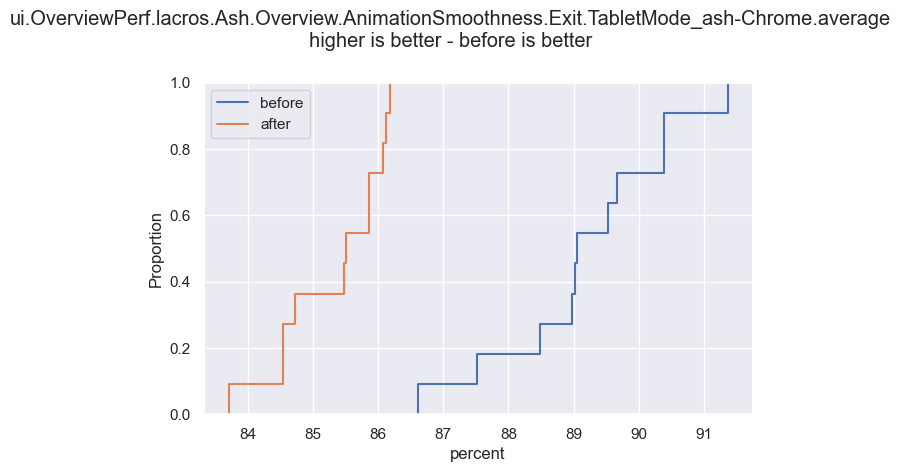

## Introduction

Performance test results (particularly from Tast tests) can be very noisy. This
software package is for when you have a feature or change and you want to see
what difference it makes on the whole (so you can't use microbenchmarks, or you
want to see a holistic picture) but the effect size is low so you can't see it
on e.g. the TPS dashboard. For example, changes of 5%, 10% etc can be impossible
to pick out easily for very noisy metrics.

This package runs statistical tests on the /tmp/tast/results directory and
compares all metrics generated. It reports the statically significant ones in
order of effect size (and other orderings).

For example, if I have a change in chrome code and I want to see how it affects
power, but it only changes it by 1% or so, I can run tast tests with and without
the change 5 to 30 times then compare the produced metrics and find the
statistically significant ones with large changes.

It's useful to do this so you can check that your changes:

1. Have the intended beneficial effect you expect.
2. Don't have unintended deleterious effects (e.g. improve FPS but regress
   power).
3. Are impactful.

It's also useful to have all the statistics done for you.

## How to run the analysis

First direct the tool to a tast results directory (/tmp/tast/results) from
before your change and have it extract the metrics. The below example generates
a file `before_change.json` from the results directory.

`python3 -m analyzer.run ingest-tast --output_path before_change.json <results dir>`

Then run again on the tast results directory after your change to generate
`after_change.json`. Make sure to clear the tast results directory in between.

Then, run the analysis. This can take some time due to resampling.

`python3 -m analyzer.run print-results -c before_change.json after_change.json`

To run a quick-and-dirty analysis without confidence intervals and using the
Mann-Whitney U test (e.g. if you want results to complete in seconds not
minutes):

`python3 -m analyzer.run print-results -c before_change.json after_change.json
--statistic-kind rank-sum`

This will run a default "safe" statistical analysis on the mean of each metric.
It errs on the side of avoiding false positives - i.e., it will try not to
report wrong significant changes. There is a trade off between minimizing wrong
results and missing real results, however. Below is a brief explanation of
the various knobs and levers on tast-analyzer. Also, the command line help via
`--help` and also the code provides an explanation of every option.

`--analyses`:

Which analyses to run. This affects the command line output.

`--skip-all-zero`:

Some tests output only zeros for some metrics. This flag skips those metrics.

`--alpha-value`:

This is like the "p-value", except tast-analyzer works with a large set of
hypothesis tests, not a single one. The default is 0.05.

`--multiple-test-correction`:

Since tast-analyzer works with multiple hypothesis tests, if we used a p-value
of e.g. 0.05 for each test, we would end up with many false positives. So,
usually p-values are corrected for in multiple hypothesis tests. Tast-analyzer
provides a method for family-wise error rate correction (FWER) and false
discovery rate error correction (FDR) that are robust to assumptions about the
correlation between each test metric.

The alpha value is used for this, and for FWER it means that there is a e.g. 5%
(for alpha = 0.05) chance that at least one of the hypothesis tests are wrong
(false positives). For FDR, it means that around 5% of the hypothesis tests are
wrong. FWER is more conservative (less false positives) so it is used by
default, but this is a good option to change if you are getting told there are
no significant changes and you think there might be some, if you can tolerate a
few more false positives.

`--minimum-sample-size`:

Some tests fail often and don't produce a large enough sample. By increasing
this you can improve your FDR/FWER budget and get more statistical power over
the entire set of test metrics. This is because it will prune the low sample
size metrics from the analysis which wouldn't have been statistically
significant anyway.

`--remove-outliers`:

This is off by default but trims the maximum and minimum value for each sample.
If you find yourself needing this (e.g. tests are /very/ noisy), consider using
median as a test statistic instead.

`--confidence`:

Tast-analyzer uses bootstrapping to report confidence intervals for samples that
are big enough. This denotes the confidence interval (by default, 95%).

`--deterministic`:

Whether to run the permutation and bootstrapping tests in a deterministic way.

`--resamples`:

How many resamples to use. This is by default around 100000, which may seem very
high but is necessary for high accuracy results, particularly when we need to
generate significant enough results to pass through multiple hypothesis testing.

`--statistic-kind`:

Which test statistic to use. Most people will want to leave it as the default of
`mean`. If you need to run tast-analyzer many times (exploratively), you can
choose `rank-sum` which will use Mann-Whitney U and take much less time. If your
data is extremely noisy, it may be useful to run with `median`. Also, if you
want to see if the standard deviation has changed, you can run with `stddev`.
This may be useful for detecting changes that make things more janky or
variable.

## How to generate graphs

Tast-analyzer can also generate graphs. For example, it can generate CDF graphs:



To generate graphs, provide the `--plots` and `--plot-dir` option.

`python3 -m analyzer.run print-results -c before_change.json after_change.json
--plots plot_cdf --plot-dir plots`

## Statistical methodology

Tast-analyzer is written to avoid false positives as much as possible. Multiple
test correction is used. For hypothesis testing, almost no assumptions are made
about the distribution of the data. The goal is to find real significant changes
in the data with minimal false positives and the highest statistical power
possible without knowing the distribution of each test metric.

For sample sizes more than one, permutation testing is used on the pooled sample
where the null hypothesis is that the resampled test statistic is no different
to the observed test statistic.

Permutation testing is used over bootstrapping for hypothesis testing because
it is the more appropriate tool. It has higher sensitivity and always has
all of the same observations as the original data, whereas bootstrapping can
miss or duplicate outliers.

Mann-Whitney U testing is also provided for hypothesis testing since it is also
non-parametric but runs much faster than permutation testing. It's also used
as a fallback in the case that one of the samples has a size of one.

Data from tast tests also can have high skewness, so a t-test is also
inappropriate (t-tests on highly skewed data with a small sample size are not
robust).

Bootstrapping is used to compute confidence intervals on the test statistic
if the sample size is large enough for it to have a reasonable chance of being
statistically valid.

### How to get more statistical power

If you have a nice improvement in metrics but it's not statistically
significant, it doesn't mean it doesn't exist. You just may not have enough
statistical power. Here's what you can do:

Run the Tast tests more times. This will give more statistical power.

Restrict the metrics analysed to a subset using the `-i` (include) or `-e`
(exclude) flag. This flag takes a regex and restricts to, or excludes metric
names matching that regex. Since the FWER and FDR is like a budget over many
tests with varying p-values, restricting to the set you are interested in can
give more statistical power. Be careful though, if you are finding yourself
doing a lot of work to restrict subsets to get a paritcular metric or set of
metrics to be statstically significant, you are probably p-hacking. It's best to
decide the set of metrics you care about /before/ looking at whether they are
statistically significant or not. c.f. the concept of pre-registered clinical
trials.

## Tips

Some tests may be sensitive to device state after logout, in that case you can
reboot between tests (make sure to sudo emerge sshpass):

```
  sshpass -p test0000 ssh dut-eth reboot
  sleep 120
```

- Try to ensure a stable temperature of the room
- Do not move the dut or adjust it during the test, because it can affect the
  thermal environment (e.g. resting on a wooden desk or metal plate)
- Use the same exact device - thermal properties and performance differs even
  between the same SKU.
- Be careful of spurious results - we still need to analyse and understand the
  changes we see.


## How to build for local perf tests

This section describes how to build and deploy, assuming you want to replicate a
release environment while keeping random variation down.

### Ash-chrome
Modify
[CheckStudyPolicyRestriction](https://source.chromium.org/chromium/chromium/src/+/main:components/variations/study_filtering.cc;l=153;drc=0d5fd0dbd26e4cc48c2b5ba35412c1045ab16dfb)
to always return false.

Be careful not to just append the args to out_SDK_BOARD/Release/args.gn if you
are using shell-based simplechrome. It will work the first time, but get removed
when re-entering the simplechrome shell. Better to specify the args when
entering the shell:

`cros chrome-sdk --board=BOARD --log-level=info  --internal --cfi --thinlto``

We want these args:

```
use_goma=true
is_debug=false
is_chrome_branded=true
is_official_build=true
dcheck_always_on=false
use_thin_lto = true
is_cfi = true
is_component_build = false
```

### Lacros-chrome

Make sure to modify CheckStudyPolicyRestriction as described above.

Build flags should be like this:

```
import("//build/args/chromeos/amd64-generic-crostoolchain.gni")
target_os="chromeos"
is_chromeos_device=true
chromeos_is_browser_only=true
use_goma=true
is_debug=false
is_chrome_branded=true
is_official_build=true
dcheck_always_on=false
use_thin_lto = true
is_cfi = true
is_component_build = false
``````

Note that you need:
```
"custom_vars": {
  "checkout_pgo_profiles": True,
},
```
in .gclient.

### ChromeOS image

You need these USE flags:

```
export USE="chrome_internal -cros-debug"
```

```
build_packages --board=BOARD --withdev --use-any-chrome
build_image --board=BOARD --noenable_rootfs_verification test
```

## How to run local perf tests

Create a script like this and run it after deploying what you need to test. For
example, if you have a change that may affect both ash-chrome and lacros-chrome,
you should deploy both. The following script is for that situation:

```sh
#!/bin/sh
for i in {1..10}; do
time tast run --var=lacros.DeployedBinary=/usr/local/lacros-chrome dut-1 \
ui.DesksCUJ ui.DesksCUJ.lacros ui.OverviewPerf ui.OverviewPerf.lacros
done
```

To get enough statistical power, run at least 10 times. Replace "dut-1" with the
hostname of your dut. lacros.DeployedBinary is specified, meaning use the
deployed lacros. Look for tast tests that your change may affect.
